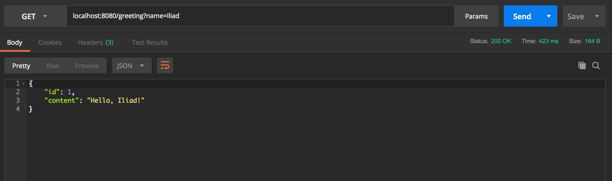
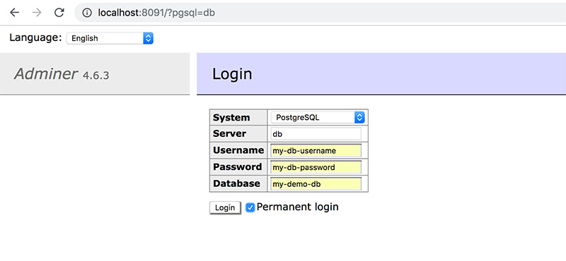

# springboot-rest-api
A starter REST setup using Spring Boot



## How to Run:
1. Execute `Application.java` inside `src/main/java/hello`
2. Make a `GET` request to `localhost:8080/greeting?name=John`

## Docker
1. Run:
```sh
cd docker && docker-compose up
```
2. You will find the **adminer** dashboard available on `localhost:8091`:

3. Open this URL in your browser to get **postico** to find the DB, `postgresql://localhost:5432/my-demo-db`